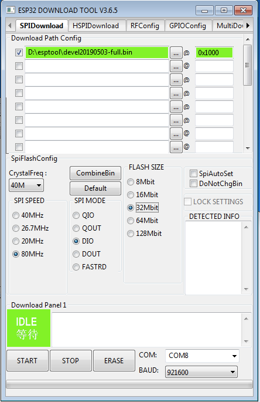

# rdz_ttgo_sonde

See <https://dl9rdz.github.io/rdz_ttgo_sonde/download.html> for automated builds.

## ESP32 web flash tool

<esp-web-install-button id="install-button" manifest="https://rdzsonde.org/manifest.json"></esp-web-install-button>

<script type="module" src="webserial/install-button.js?module"></script>
<br>


## esptool command line


For downloading these to the ESP32 board, use something like

```
esptool --chip esp32 --port /dev/cu.SLAB_USBtoUART --baud 921600 --before default_reset --after hard_reset write_flash -z --flash_mode dio --flash_freq 80m --flash_size detect 0x1000 <filename.bin>
```

Most important part is the start offset 0x1000.

The binary image contains everything including the flash file system, so all configurations options will be overwritten. If you want to update only the software, you can flash update.ino.bin at offset 0x10000 (or use OTA update via
http://rdzsonde.local/update.html).


## esptool GUI version

If you prefer a GUI instead of a command line flash tool, you can get the Flash Download Tools from
<https://www.espressif.com/en/support/download/other-tools>

Here are the correct settings for flashing one of the images:


